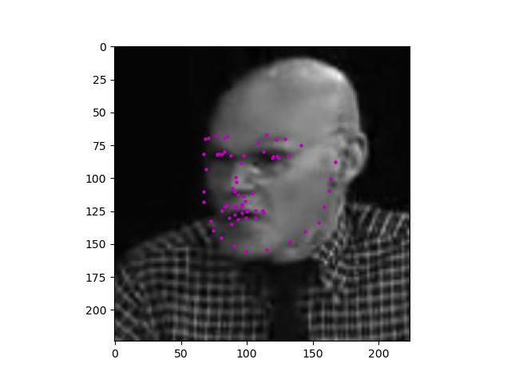

# Prerequisite
* python3.10

# Environment Setup

```sh
conda create --name myenv --file spec-file.txt
```

# How to train?
```sh
conda activate myenv
python train.py
```

# How to inference?
```sh
python inference.py --input <image-path> --model <model.pth path>
```

# Project Overview


This is a simple implementation of FacialKeypointsDetection(aka. FKD). I used a data from
[Facial-Keypoint-Detection-Udacity-PPB](https://github.com/ParthaPratimBanik/Facial-Keypoint-Detection-Udacity-PPB?tab=readme-ov-file).

We had a very small training dataset of only 3,462 samples, so we couldn’t build a model with high complexity. Even with a simple model, overfitting was severe: the training loss was extremely low, while the validation loss was very high.

To address this overfitting issue, we applied the following:
	1.	Reduce model complexity by lowering the number of filters (thus fewer parameters).
	2.	Add Dropout layers and adjust their dropout rates.
	3.	Perform data augmentation.
	4.	Adjust the learning rate.
	5.	Adjust the batch size.

Applying each of these individually did not yield a significant effect, but after combining some of them and increasing the number of FC layers at the end, we resolved the overfitting problem.

## Final Solution

We reduced the number of layers in the model and decreased the number of filters, then increased the FC layers to two stages. We also added a Dropout layer before passing through the FC layers to prevent overfitting. Our rationale was that using only one FC layer to directly map the CNN features to coordinates—without any intermediate non-linear step—would cause the model to overfit more easily. We assumed the single FC weight matrix would “memorize” the patterns excessively. After that, we lowered the learning rate and introduced a weight decay value. Weight decay is an L2 regularization method that penalizes the weight gradient updates so that they decay over time. When w grows large, the L2 term increases, causing the loss to rise and discouraging the model from inflating the weights unnecessarily

```math
$$
\mathbf{w} \leftarrow \mathbf{w} - \alpha \frac{\partial \mathcal{L}}{\partial \mathbf{w}} - \alpha \lambda \mathbf{w}
$$
```

Finally, we adjusted the batch size. When the batch size is large, gradient estimates—based on the average over more samples—are more stable, and convergence can be faster. However, because there are fewer optimizer updates overall, the gradient direction can be determined in a single large step. Conversely, if the batch size is small, fewer samples per update mean larger variance in the gradient, which makes the model less “certain” and thus can improve generalization performance.

First loss history
```txt
Epoch: 14, Batch: 160, Avg. Loss: 9.355329209938646e-05
Epoch: 14, Batch: 170, Avg. Loss: 7.567413803189992e-05
Epoch: 14, Batch: 180, Avg. Loss: 8.344895672053098e-05
Epoch: 14, Batch: 190, Avg. Loss: 9.385474305599928e-05
Epoch: 14, Batch: 200, Avg. Loss: 9.024027781561017e-05
Epoch: 14, Batch: 210, Avg. Loss: 0.00010027314303442836
Epoch: 14, Val. Loss: 0.04739526138469881
Epoch: 15, Batch: 10, Avg. Loss: 7.743831072002649e-05
Epoch: 15, Batch: 20, Avg. Loss: 7.983441278338432e-05
Epoch: 15, Batch: 30, Avg. Loss: 7.70759703591466e-05
Epoch: 15, Batch: 40, Avg. Loss: 6.473299162462354e-05
Epoch: 15, Batch: 50, Avg. Loss: 7.934021390974522e-05
Epoch: 15, Batch: 60, Avg. Loss: 7.520653679966926e-05
Epoch: 15, Batch: 70, Avg. Loss: 6.982562178745866e-05
Epoch: 15, Batch: 80, Avg. Loss: 7.223713863641023e-05
Epoch: 15, Batch: 90, Avg. Loss: 8.919204398989678e-05
Epoch: 15, Batch: 100, Avg. Loss: 8.148753084242345e-05
Epoch: 15, Batch: 110, Avg. Loss: 7.730655325576663e-05
Epoch: 15, Batch: 120, Avg. Loss: 6.509649381041526e-05
Epoch: 15, Batch: 130, Avg. Loss: 7.729305932298303e-05
Epoch: 15, Batch: 140, Avg. Loss: 7.61190066114068e-05
Epoch: 15, Batch: 150, Avg. Loss: 7.095744833350181e-05
Epoch: 15, Batch: 160, Avg. Loss: 7.701387582346797e-05
Epoch: 15, Batch: 170, Avg. Loss: 8.434717822819948e-05
Epoch: 15, Batch: 180, Avg. Loss: 8.221889054402709e-05
Epoch: 15, Batch: 190, Avg. Loss: 8.406763849779963e-05
Epoch: 15, Batch: 200, Avg. Loss: 8.40630978345871e-05
Epoch: 15, Batch: 210, Avg. Loss: 8.343502786010504e-05
Epoch: 15, Val. Loss: 0.038476123759637076
```

Final loss history
```txt
Epoch: 20, Batch: 200, Avg. Loss: 5.05592655390501e-05
Epoch: 20, Batch: 210, Avg. Loss: 5.3356994641944764e-05
Epoch: 20, Batch: 220, Avg. Loss: 5.605308664962649e-05
Epoch: 20, Batch: 230, Avg. Loss: 5.4565400583669544e-05
Epoch: 20, Batch: 240, Avg. Loss: 5.5143519304692744e-05
Epoch: 20, Batch: 250, Avg. Loss: 4.949910496361554e-05
Epoch: 20, Batch: 260, Avg. Loss: 5.7551905047148463e-05
Epoch: 20, Batch: 270, Avg. Loss: 5.791963939554989e-05
Epoch: 20, Batch: 280, Avg. Loss: 5.113267689011991e-05
Epoch: 20, Batch: 290, Avg. Loss: 6.575439777225256e-05
Epoch: 20, Batch: 300, Avg. Loss: 6.496681133285165e-05
Epoch: 20, Batch: 310, Avg. Loss: 5.77239585109055e-05
Epoch: 20, Batch: 320, Avg. Loss: 5.122640496119857e-05
Epoch: 20, Batch: 330, Avg. Loss: 5.431649973616004e-05
Epoch: 20, Batch: 340, Avg. Loss: 6.70045600272715e-05
Epoch: 20, Val. Loss: 0.00763995490677945
```
